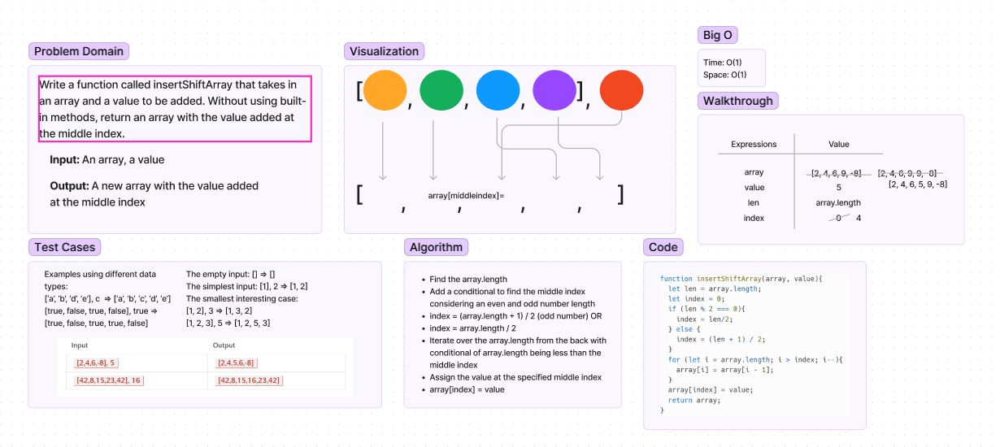

# Middle Array

## Approach 
Using simple division to find the center I iterated through a for loop from the back setting the left lateral limit as the middle value. I then moved the indices one to the right and set the target value as the target index value.